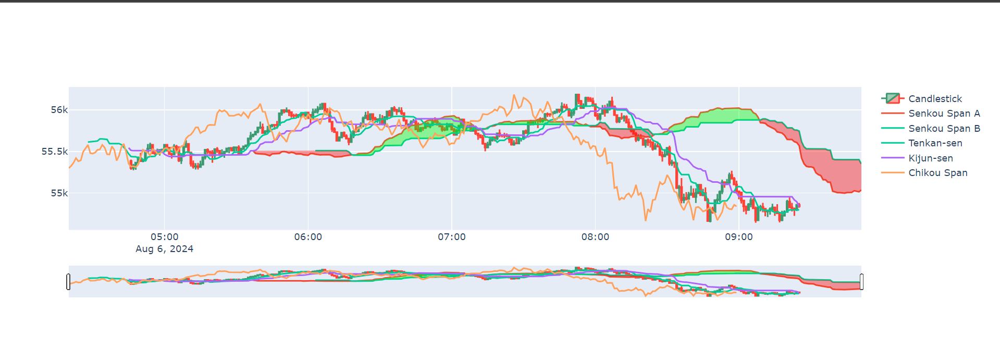

# Ichimoku Cloud Indicator with Python


This Python script visualizes the Ichimoku Cloud indicator using both real-time and historical market data. The Ichimoku Cloud is a comprehensive technical analysis tool that provides information about support and resistance levels, trend direction, and momentum in financial markets.

## Prerequisites

Ensure you have the requirements file installed.

To install the libraries listed in the `requirements.txt` file, use the following command:

```sh
pip install -r requirements.txt
```

## Environment Variables

Create a `.env` file in your project directory and add your `CLIENT_ID` and `CLIENT_SECRET`:

```env
CLIENT_ID=your_client_id
CLIENT_SECRET=your_client_secret
```

These variables enable secure access to market data from the [HSTRADER](https://staging.hstrader.com/login) platform.

**Reminder:**
Your unique `CLIENT_ID` and `CLIENT_SECRET` can be obtained from your personal account on the platform. Ensure you keep them confidential to protect your data.

## Ichimoku Cloud Algorithm Explained

The Ichimoku Cloud is a technical analysis tool that helps traders understand market trends, support and resistance levels, and momentum. It's made up of five main components, each providing different information about the market:

1. **Tenkan-sen (Conversion Line):**
   - **Calculation:** It takes the highest and lowest prices over the last 9 periods (days or hours, depending on your chart), adds them together, and divides by 2.
   - **Purpose:** This line shows short-term market momentum.

2. **Kijun-sen (Base Line):**
   - **Calculation:** Similar to the Tenkan-sen, but it looks at the last 26 periods instead of 9.
   - **Purpose:** It indicates medium-term market momentum.

3. **Senkou Span A (Leading Span A):**
   - **Calculation:** It takes the average of the Tenkan-sen and Kijun-sen and shifts it forward by 26 periods.
   - **Purpose:** This line forms one boundary of the cloud.

4. **Senkou Span B (Leading Span B):**
   - **Calculation:** It takes the highest and lowest prices over the last 52 periods, adds them together, divides by 2, and shifts it forward by 26 periods.
   - **Purpose:** This line forms the other boundary of the cloud.

5. **Chikou Span (Lagging Span):**
   - **Calculation:** It simply shifts the current closing price back by 26 periods.
   - **Purpose:** This line helps confirm trends and can signal potential buy or sell opportunities.

## Conclusion

The Ichimoku Cloud is a powerful tool for technical analysis, offering traders a multi-dimensional view of the market. Its ability to provide insights into trend direction, momentum, and key support/resistance levels makes it an invaluable indicator for both novice and experienced traders.
